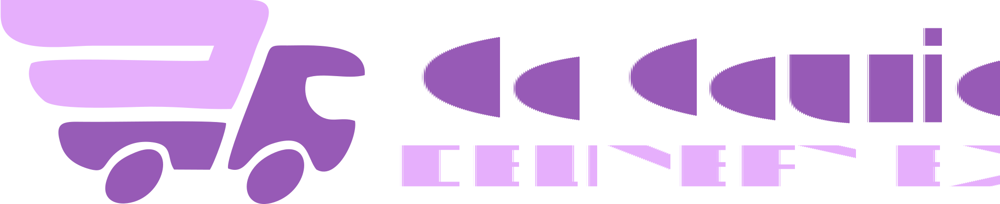
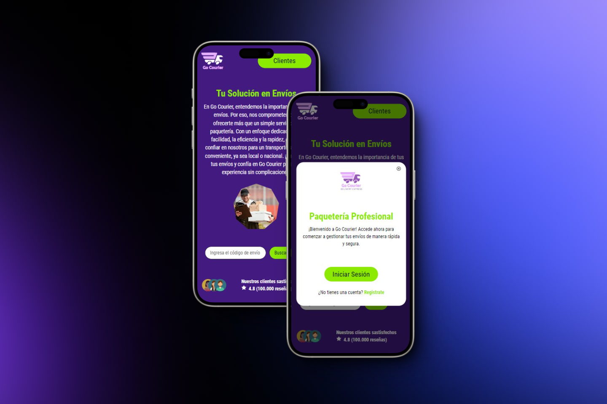

<!-- PROJECT LOGO -->
 
  

    
    <h3 align="center">¡Bienvenidos a Go Courier!</h3>
  

<!-- ABOUT THE PROJECT -->

  

    <strong>Go Courier</strong> es un sistema de envíos de paquetería que prioriza la facilidad y la eficiencia. Nuestra plataforma integra tecnología avanzada con un enfoque centrado en el cliente para ofrecer soluciones logísticas confiables y rápidas. Con nosotros, puedes enviar y rastrear tus paquetes de manera segura y conveniente, tanto a nivel local como nacional.<strong> ¡Simplifica tu envíos con Go Courier!</strong>
  

    

<!-- TABLE OF CONTENTS -->

  <h2>Contents</h2>
  <ul>
    <li><a href="#features">Features</a></li>
    <li><a href="#built-with">Tech Stack</a></li>
    <li><a href="#visualization">Project Visualization </a></li>
    <li><a href="#roadmap">Roadmap</a></li>
    <li><a href="#developers">Developers</a></li>
  </ul>

 

<!-- DESCRIPTION -->
<h2 id="features">🚀 Features</h2>
 
<ul>
  <li><strong>✔ Autenticación y Seguridad:</strong> Se proporciona un proceso confiable de registro y autenticación a nivel local, garantizando la seguridad y privacidad  de los usuarios.  
  <li><strong>✔ Seguimiento de envíos:</strong> Los usuarios pueden rastrear el estado y la ubicación de sus paquetes en tiempo real, lo que proporciona transparencia y tranquilidad durante el proceso de envío.  
  <li><strong>✔ Envíos locales y nacionales:</strong> Se proporciona un servicio integral que cubre tanto envíos locales como nacionales, lo que permite a los usuarios enviar paquetes a diferentes destinos dentro del país.  
  <li><strong>✔ Diseño Adaptable:</strong> Diseño web totalmente adaptable para una experiencia de navegación fluida en todos los dispositivos.  
  <!-- agregar dashboard -->
</ul>

<h2 id="built-with">🛠️ Tech Stack</h2>

<h3>Front-End</h3>

 

<h3>Back-End</h3>

  

<h3>UX/UI</h3>
  
 
<!-- <h2 id="built-with">🛠️ Herramientas & Organización</h2>

 <!-- 

   -->
<h2 id="visualization">🌐 Project Visualization </h2>

 

<!-- 
<a href="#readme-top"> ⬆ </a>
 -->

<!-- ROADMAP -->
<h2 id="roadmap">🎯 Links</h2>

🚀 **Deployed Website**: [Visit here](https://c16-03-m-node-react.vercel.app/)

🔎 **Original Repository**: [Check it out](https://github.com/No-Country/C16-03-m-node-react-)

🚀 **Deployed Website**: [Visit here](https://www.figma.com/file/OeKWjjHbiLfBFLOBojFuJp/No-Country?type=design&node-id=0-1&mode=design&t=NyFacDqZwzK8AA6I-0)

 

<!-- CONTACT US-->
<h2 id="developers">💻 Developers</h2>
<table>
  <tr>
    <td>
      

        
          <h4 style="margin-top: 1rem;">Clay Martinez</h4>
          <h4 style="margin-top: 1rem;">Frontend Developer</h4>
        
          
      

    </td>
    <td>
      

          
          <h4 style="margin-top: 1rem;">Facundo Contreras</h4>
          <h4 style="margin-top: 1rem;">Frontend Developer</h4>
        
          
      

    </td>
   <td>
      

        
          <h4 style="margin-top: 1rem;">German Ravarotto</h4>
          <h4 style="margin-top: 1rem;">Frontend Developer</h4>
        
          
      

    </td>
    <td>
      

        
          <h4 style="margin-top: 1rem;">Maximo Valfre</h4>
          <h4 style="margin-top: 1rem;">Frontend Developer</h4>
        
          
      

    </td>
  </tr>
</table>

<table>
  <tr>
    <td>
      

        
          <h4 style="margin-top: 1rem;">Esteban Sayago</h4>
          <h4 style="margin-top: 1rem;">Backend Developer</h4>
          
          
      

    </td>
     <td>
      

        
          <h4 style="margin-top: 1rem;">Carlos Escobar</h4>
          <h4 style="margin-top: 1rem;">Backend Developer</h4>
        
          
      

    </td>
   <td>
      

        
          <h4 style="margin-top: 1rem;">Jordan Esquivel</h4>
          <h4 style="margin-top: 1rem;">Backend Developer</h4>
        
          
      

    </td>
    <td>
      

        
          <h4 style="margin-top: 1rem;">Micaela Ortiz</h4>
          <h4 style="margin-top: 1rem;">Backend Developer</h4>
        
          
      

    </td>
  </tr>
</table>

